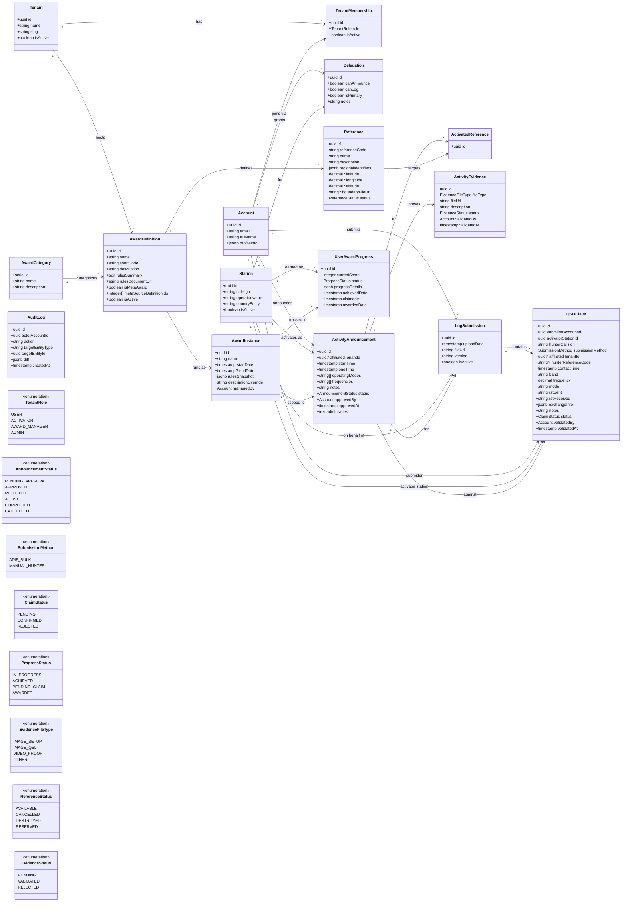

# Domain Model — Open Ham Awards (V7 — P0/P1 Consumer MVP)

> Generalized, multi-tenant domain. Scoped to admin-driven MVP validation.
> Post-MVP features (automated cross-validation, PDF certificate generation) are excluded.

## Mermaid Class Diagram



## Entity Glossary

| Entity | Context | Description |
|---|---|---|
| `Tenant` | Identity | An organization (club, association) that hosts award programs. Multi-tenancy root. |
| `Account` | Identity | A person who uses the platform. Has no global role — roles are per-tenant via `TenantMembership`. |
| `TenantMembership` | Identity | Join between Account and Tenant. Carries a `TenantRole` so the same person can be Admin in one tenant and User in another. |
| `Station` | Identity | A licensed callsign. Separate from Account (one operator may hold multiple licenses). |
| `Delegation` | Identity | Grants an Account permission to announce or log on behalf of a Station. |
| `AwardCategory` | Award Definition | Groups award definitions (e.g. "Castles", "Railways", "Monuments"). |
| `AwardDefinition` | Award Definition | The template for an award: name, rules summary, scoring rules. Replaces legacy-specific diplomas (DCE, DEFE, etc.). |
| `AwardInstance` | Award Definition | A concrete, temporal edition of a definition (e.g. "DCE 2026"). Snapshots the rules at creation time so future rule edits never retroactively break scoring. **Temporal pattern:** permanent awards use a `NULL` endDate — the instance stays open indefinitely. If the definition's rules change, the current instance is closed (endDate set) and a new instance is spawned from the same definition with the updated rules snapshot. Yearly/seasonal awards spawn a new instance annually from the same definition. |
| `Reference` | Award Definition | A geographic location tied to a definition. `referenceCode` is the primary textual identifier (e.g. "CZA-003"). `regionalIdentifiers` (JSONB) is a key-value store for arbitrary region- or program-specific codes (e.g. `{"dme": "CZA-003", "province": "Cádiz", "municipality": "Algeciras", "jcc": "2701"}`) — replaces hardcoded regional columns to support any locale or award system globally. `latitude`, `longitude`, and `altitude` are intentionally nullable to support the asynchronous admin workflow where a reference is created before physical GPS mapping is completed. `altitude` supports elevation-based award scoring (e.g. SOTA). `status` uses `ReferenceStatus`: `AVAILABLE` (can be activated), `RESERVED` (claimed but not yet activatable), `CANCELLED` (administratively withdrawn), `DESTROYED` (physically no longer exists — e.g. a demolished castle). A `DESTROYED` reference cannot be activated for new announcements but remains mathematically valid for past QSO claims and scoring. `boundaryFileUrl` is nullable — stores a URL to a spatial boundary file (KML, GPX, or GeoJSON) for frontend map rendering, supporting both polygon-based references (e.g. Parks) and point-based references (e.g. Summits). |
| `ActivityAnnouncement` | Activity | An activator's declared intent to operate at a reference. Lifecycle: `PENDING_APPROVAL` → `APPROVED` → `ACTIVE` → `COMPLETED`. Ends at `COMPLETED`; evidence and logs are separate contexts. `affiliatedTenantId` is nullable — used in V2 for club-level leaderboard aggregations (`SUM` by tenant). |
| `ActivatedReference` | Activity | Join linking an announcement to one or more references activated during the operation. |
| `ActivityEvidence` | Activity | Proof of activation (photos, video). Logs are **not** evidence — they are state in the Ingestion context. |
| `LogSubmission` | Ingestion | An uploaded ADIF file. Parsed into individual `QSOClaim` entries with `submissionMethod: ADIF_BULK`. A `QSOClaim` created via bulk upload **always** belongs to a `LogSubmission`. |
| `QSOClaim` | Ingestion | A single contact claim representing one QSO between an activator and a hunter. **No polymorphic ambiguity:** `activatorStationId` (FK → Station) always identifies the activating station, `hunterCallsign` (string) always identifies the hunter, and `submitterAccountId` (FK → Account) identifies who created the record — regardless of submission method. `submissionMethod` discriminates origin: `ADIF_BULK` (parsed from a `LogSubmission`) or `MANUAL_HUNTER` (submitted directly against an `ActivityAnnouncement`, `LogSubmission` is `NULL`). Admin-validated: `PENDING` → `CONFIRMED` / `REJECTED`. `hunterReferenceCode` is nullable — V2 Park-to-Park multiplier scoring. `affiliatedTenantId` is nullable — V2 club-level leaderboard aggregations. |
| `UserAwardProgress` | Scoring | Tracks a Station's cumulative progress toward an `AwardInstance`. `currentScore` is an integer that increments by 1 when a `QSOClaim` is marked `CONFIRMED` by an admin (MVP behavior). Named `currentScore` rather than `confirmedCount` to prevent API contract breakage when V2 introduces penalties (decrements) and multipliers (non-unit increments). |
| `AuditLog` | Infrastructure | Append-only ledger tracking "who did what, when" for critical domain mutations. `actorAccountId` identifies the person, `action` is the verb (e.g. `CREATED`, `UPDATED`, `STATUS_CHANGED`, `DELETED`), `targetEntityType` + `targetEntityId` identify what was affected, and `diff` (JSONB) captures the before/after snapshot. Loosely coupled — no foreign keys to domain entities; queried by type + id. |

## MVP Scoring Flow

```text
Admin confirms QSOClaim via API
        │
        ▼
QSOClaim.status = CONFIRMED
        │
        ▼ traverse: QSOClaim → ActivityAnnouncement → AwardInstance
        │
        ▼
UserAwardProgress.currentScore++ (for the claiming Station + AwardInstance)
        │
        ▼
Evaluate threshold: currentScore >= AwardInstance.rulesSnapshot.threshold?
        │
    ┌───┴───┐
    No      Yes → ProgressStatus = ACHIEVED
```

**Scoring route:** every `QSOClaim` is linked to an `ActivityAnnouncement`, which is scoped to exactly one `AwardInstance`. When an admin confirms a claim, the system resolves the target `UserAwardProgress` by following `QSOClaim` → `ActivityAnnouncement` → `AwardInstance` and matching the claiming `Station`. No fan-out or ambiguity.

**MVP behavior:** `currentScore` increments by 1 per confirmed claim. The field is intentionally named `currentScore` (not `confirmedCount`) so the API contract survives V2 changes — penalties will decrement it, Park-to-Park multipliers will increment by >1.

## Context Mapping to ARCHITECTURE.md Modules

| Module | Entities |
|---|---|
| **Identity** | `Tenant`, `Account`, `TenantMembership`, `Station`, `Delegation` |
| **Ingestion** | `LogSubmission`, `QSOClaim` |
| **Scoring** | `UserAwardProgress` |
| **Activity** | `ActivityAnnouncement`, `ActivatedReference`, `ActivityEvidence` |
| **Award Definition** | `AwardCategory`, `AwardDefinition`, `AwardInstance`, `Reference` |
| **Infrastructure** | `AuditLog` |
